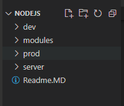
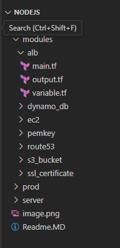

Requirements: 
1. We have to deploy nodejs app into ec2 using terraform modules. 

Resources: 
1. Use security group which is already created in the console.
2. Use vps and Subnets which is already created in the console. 
3. Use EIP which is already created in the console. 
4. Use Main domain which is already created in the console. 

5. Create a new Ec2 instance for ubuntu O.S. and run the 
local provisioner for copy node app from local to remote. 
execute the remote provisioner for node app setup in the docker container. 
6. Create a new TG and attach to the node_ec2.
7. Create a ALB and attach to the Node_tg.
7. Create a new pemkey for login to the node ec2. 
8. Create a new dynamo_db table to lock terraform state file. 
9. create a new s3 bucket for store the tf.state file.
10. Create new new record in the route 55 for node app access sub_domain. 
11. Create a new SSL for sub domain for Protect and secure the node app access. 

Directory Structure: 

=====================================================================================================================

Step-1:cd Download the Node-cicd.zip file and extract it. 
Step-2: change the directory to dev and change the values what you want.

" cd dev "

Step-3: initialize the terraform plugins.
Note: Before run the terraform init command, should be comment the terraform backend code which is present in the 
dev/main.tf line number 8 to 16. Because after s3 bucket create then only state file generate and store into s3.

" terraform init "

Step-4: dry run the code what code exactly do

"terraform plan  "

Step-5: create the s3 bucket only. {This is one time activity only}

"terraform apply --target=module.s3_bucket --auto-approve "

Step-6: create dynamo_db table

"terraform apply --target=module.dynamo_db --auto-approve"

Step-7: create the ec2 and pem key and deploy the node app into ec2.
Note: no enable the tf state file code which is present to dev/main.tf from line 8 to 16.

"terraform init -reconfigure --auto-approve "
"terraform plan "
" terraform apply --auto-approve "

Verify: copy the ec2_public_key and browse it. 

http://98.80.109.198:3000/students

=====================================================================

Step-8: Destroy the whole infra.

"  terraform destroy --auto-approve -lock=false "

Note: s3 bucket is not deleted because s3 bucket is not empty. 

===============================================================

Step-9: Re-deploy again. 

" terraform init -reconfigure "

" terraform plan -lock=false "

" terraform apply --target=module.dynamo_db -lock=false --auto-approve "

" terraform apply --auto-approve "

